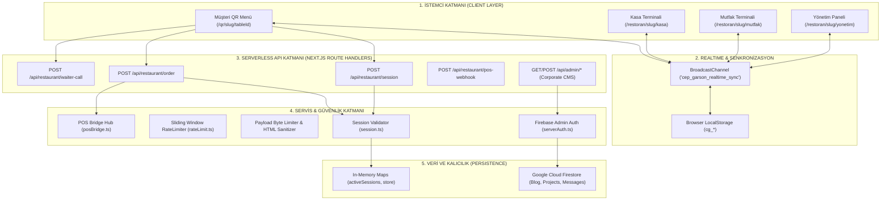
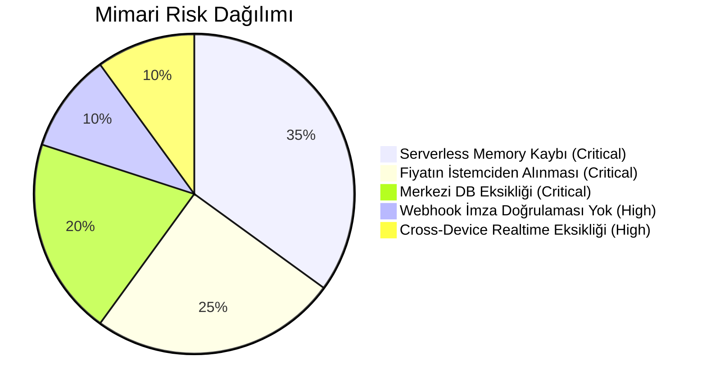

# CEP GARSON — MİMARİ HARİTASI (ARCHITECTURE MAP)
**Faz:** FAZ 0 — Architecture Mapping  
**Tarih:** 2026-08-21  

---

## 1. KATMANLI MİMARİ ŞEMASI (LAYERED ARCHITECTURE)

---

## 2. BİLEŞEN VE DİZİN YAPISI

| Katman | Dizin / Dosya | Sorumluluk |
| :--- | :--- | :--- |
| **QR Client** | `src/app/qr/[restaurantSlug]/[tableId]/page.tsx` | Menü listeleme, ortak sepet, garson çağırma, hesap bölme |
| **Kasa POS** | `src/app/restoran/[restaurantSlug]/kasa/page.tsx` | Masa salon planı, adisyon kapama, e-fatura, acil alarmlar |
| **Mutfak KDS** | `src/app/restoran/[restaurantSlug]/mutfak/page.tsx` | İstasyon bazlı sipariş hazırlığı, timer, sesli ikaz |
| **Yönetim Boss** | `src/app/restoran/[restaurantSlug]/yonetim/page.tsx` | Reçete/maliyet kâr matrisi, personel PIN/2FA, Z raporu |
| **Store** | `src/lib/restaurant/store.ts` | Reaktif state yönetimi, cross-tab BroadcastChannel sync |
| **Session** | `src/lib/restaurant/session.ts` | 15 dakikalık masa token üretimi ve doğrulama |
| **API Endpoints** | `src/app/api/restaurant/*` | Sipariş kabulü, oturum yenileme, webhook alımı |
| **Güvenlik** | `src/lib/security/*` | Sliding window rate limit, byte stream limit, sanitize |

---

## 3. MİMARİ BAĞIMLILIKLAR VE RİSK MATRİSİ

