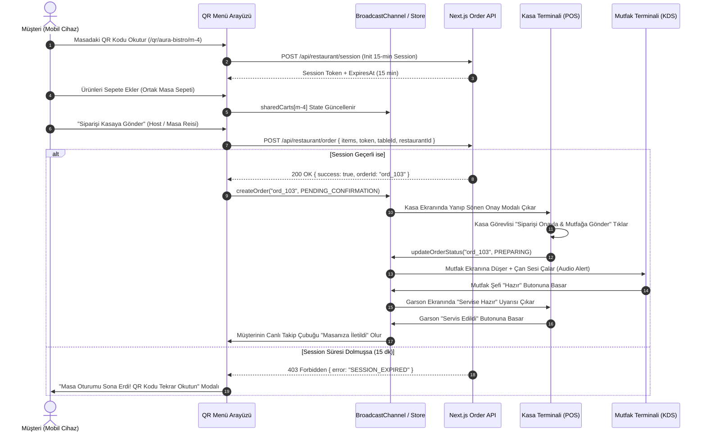
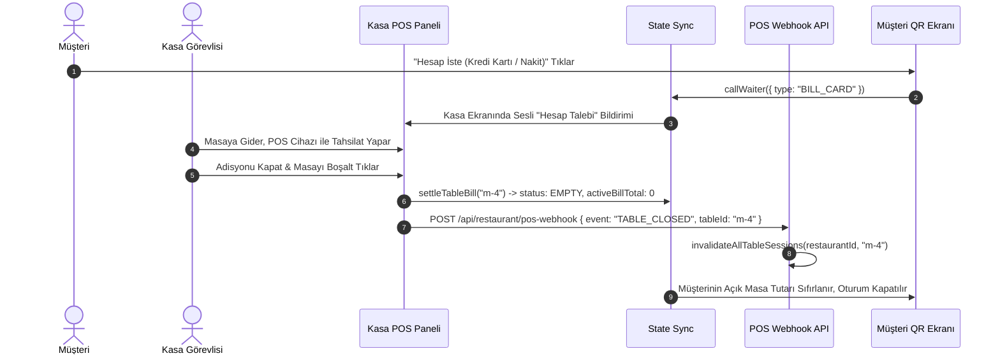
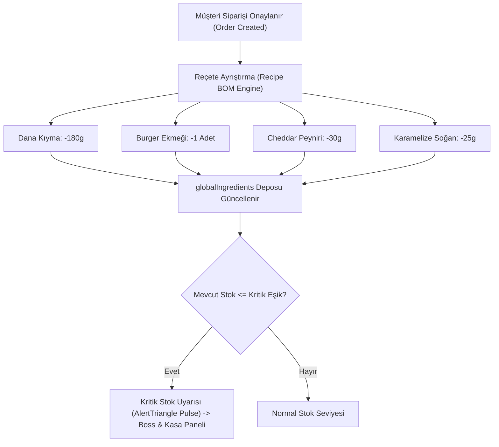

# CEP GARSON — VERİ AKIŞ HARİTASI (DATA FLOW MAP)
**Faz:** FAZ 0 — Data Flow Analysis  
**Tarih:** 2026-08-21  

---

## 1. MÜŞTERİ SİPARİŞ & MASADAN ÖDEME AKIŞI

---

## 2. HESAP KAPATMA VE ADİSYON TAHSIİLATI AKIŞI

---

## 3. HAMMADDE VE REÇETE STOK DÜŞÜM AKIŞI

