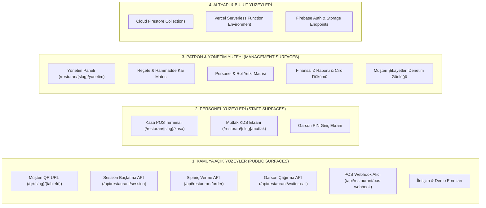

# CEP GARSON — SALDIRI YÜZEYİ ANALİZİ (ATTACK SURFACE)
**Faz:** FAZ 1 — Attack Surface Mapping  
**Tarih:** 2026-08-21  

---

## 1. SALDIRI YÜZEYİ HARİTASI (ATTACK SURFACE MAP)

---

## 2. GİRİŞ NOKTALARI VE GÜVENLİK DEĞERLENDİRMESİ

1. **Müşteri QR Menü Girişi:**
   - *Girdi:* URL'deki `restaurantSlug` ve `tableId`.
   - *Risk:* URL brute-forcing (Masa 1 yerine Masa 50 yazma), başka masanın sepetini görme/ekleme.
   - *Önlem:* Masa ID'leri yerine cryptographically random table session token'lar veya dinamik QR kodlar.

2. **Sipariş Oluşturma Girişi:**
   - *Girdi:* `items` array, `notes`, `sessionToken`.
   - *Risk:* XSS enjeksiyonu (`notes` alanına `<script>` yazılması), negatif miktar (`quantity: -5`), fiktif ürün ID'leri.
   - *Önlem:* Sıkı Zod şema doğrulaması, `sanitize-html` ile not temizliği, pozitif tamsayı (`quantity >= 1`) zorunluluğu.

3. **Yönetim Paneli Girişi:**
   - *Girdi:* Master PIN, 2FA SMS/App kodu.
   - *Risk:* Brute-force saldırıları, `sessionStorage` manipülasyonu.
   - *Önlem:* Hatalı PIN denemelerinde IP ve kullanıcı bazlı rate limiting (örn: 5 hatalı denemede 15 dk kilitleme).
