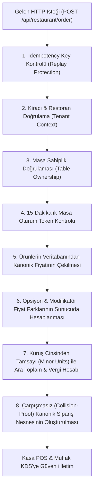

# CEP GARSON — KANONİK SUNUCU İŞ MANTIĞI VE FİYATLANDIRMA MOTORU
**Faz:** FAZ 2 — Canonical Business Logic & Zero-Trust Engine  
**Tarih:** 2026-08-21  

---

## 1. ZERO-TRUST İSTEMCİ FELSEFESİ

Mevcut sistemde istemciden gelen hiçbir finansal veriye (`price`, `unitPrice`, `subtotal`, `tax`, `serviceCharge`, `totalAmount`) güvenilmez. İstemci yalnızca:
- `menuItemId` (Ürün Kimliği)
- `quantity` (Pozitif Tam Sayı Miktar)
- `selectedOptions` (Seçilen Opsiyon ID'leri)
- `sessionToken` (Masa Oturum Anahtarı)
gönderebilir.

---

## 2. KANONİK SİPARİŞ HESAPLAMA VE DOĞRULAMA AKIŞI

---

## 3. SAVUNULAN 19 FİYAT VE VERİ MANİPÜLASYONU SALDIRISI

| Saldırı ID | Saldırı Yöntemi | İstemci Girişi | Sunucu Kanonik Davranışı |
| :--- | :--- | :--- | :--- |
| **ATK-01** | Standart Kanonik Fiyat | Geçerli İstek | DB'deki menü fiyatından hesaplandı |
| **ATK-02** | Sıfır Fiyat Enjeksiyonu | `unitPrice: 0` | 0 yok sayıldı, orijinal 360 TL uygulandı |
| **ATK-03** | Negatif Fiyat Enjeksiyonu | `price: -100` | Negatif değer reddedildi, 360 TL uygulandı |
| **ATK-04** | 1 Kuruş İstismarı | `finalPrice: 0.01` | İstismar engellendi, 720 TL et fiyatı alındı |
| **ATK-05** | Taşma Denemesi (Overflow) | `price: 999999999` | Değer yok sayıldı, menü fiyatı kullanıldı |
| **ATK-06** | String Tip Manipülasyonu | `finalPrice: "0.00"` | String yok sayıldı, menü fiyatı kullanıldı |
| **ATK-07** | Null Değer Gönderimi | `price: null` | Menü fiyatı kullanıldı |
| **ATK-08** | NaN Değer Gönderimi | `price: NaN` | Menü fiyatı kullanıldı |
| **ATK-09** | Infinity Değer Gönderimi | `price: Infinity` | Menü fiyatı kullanıldı |
| **ATK-10** | Gövdede Sahte Toplam | `totalAmount: 11` | İstemci toplamı yok sayıldı, 792 TL hesaplandı |
| **ATK-11** | Modifikatör Fiyat Tahrifatı | Sahte opsiyon farkı | Sunucudaki orijinal opsiyon farkı (+65 TL) eklendi |
| **ATK-12** | Negatif Miktar Enjeksiyonu | `quantity: -5` | `HTTP 400 (INVALID_QUANTITY)` ile reddedildi |
| **ATK-13** | Kesirli Miktar Enjeksiyonu | `quantity: 1.5` | `HTTP 400 (INVALID_QUANTITY)` ile reddedildi |
| **ATK-14** | Sahte Ürün ID | `fake_hacked_item` | `HTTP 400 (PRODUCT_NOT_FOUND)` ile reddedildi |
| **ATK-15** | Mükerrer İstek (Replay) | Aynı `Idempotency-Key` | Tek işlem yapıldı, aynı sipariş ID döndü |
| **ATK-16** | Çapraz Restoran Masası | Restoran A + Masa B | `HTTP 404 (TENANT_MISMATCH)` ile engellendi |
| **ATK-17** | Süresi Dolan Oturum | Süresi dolmuş token | `HTTP 403 (SESSION_INVALID)` ile engellendi |
| **ATK-18** | Floating Point Drift | `0.10 + 0.20 TL` | Tam `0.30 TL` kuruş hassasiyeti sağlandı |
| **ATK-19** | Eşzamanlı Masa Çakışması | Aynı anda 10 istek | Çarpışmasız monotonic ID'ler ile işlendi |
