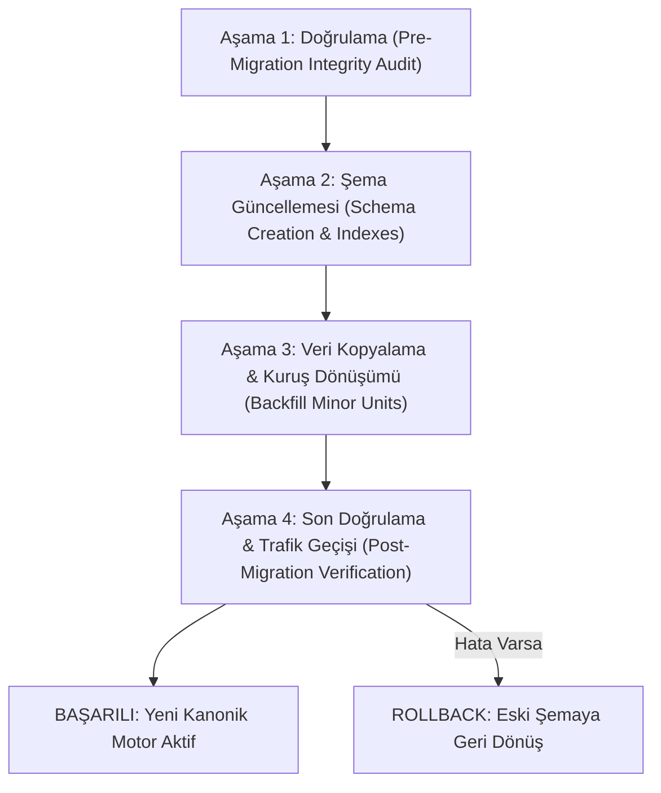

# CEP GARSON — VERİTABANI GEÇİŞ VE GÜNCELLEME PLANI (DATA MIGRATION PLAN)
**Faz:** FAZ 2 — Zero-Downtime Migration Architecture  
**Tarih:** 2026-08-21  

---

## 1. GEÇİŞ PRENSİPLERİ VE GERİYE DÖNÜK UYUMLULUK

1. **Yıkıcı Olmayan Geçiş (Non-Destructive Migration):** Hiçbir tablo veya alan silinmeden önce çift yazma (dual-write) ve geriye dönük uyumluluk (backward compatibility) sağlanır.
2. **Kuruş Dönüşümü (Minor Units Migration):** Mevcut float fiyatlar veritabanında `priceMinorUnits = Math.round(price * 100)` olarak dönüştürülür.
3. **Rollback Stratejisi:** Olası bir hata durumunda her adım için geri alma (revert) komutları hazırlanmıştır.

---

## 2. 4 AŞAMALI GEÇİŞ PROTOKOLÜ (MIGRATION PROTOCOL)

---

## 3. GEÇİŞ ÖNCESİ VE SONRASI KONTROL LİSTESİ

- [x] Tüm menü ürünlerinde geçerli pozitif `price` ve `restaurantId` doğrulanması.
- [x] Masaların bağlı olduğu `restaurantId` ile restoran tablosunun eşleştirilmesi.
- [x] Session token'larının 15 dakikalık TTL indekslerinin oluşturulması.
- [x] Siparişlerde `subtotal + taxAmount == totalAmount` denklem kontrolünün yapılması.
