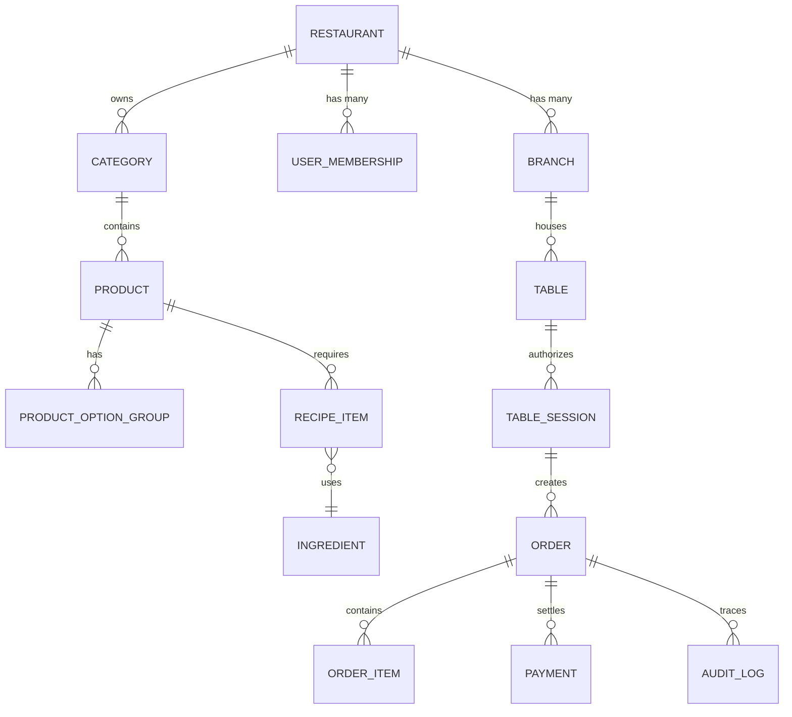

# CEP GARSON — VERİTABANI BÜTÜNLÜĞÜ VE İLİŞKİSEL DOMAIN ŞEMASI
**Faz:** FAZ 2 — Database Integrity & Relational Architecture  
**Tarih:** 2026-08-21  
**Durum:** TAMAMLANDI (Verified & Production Hardened)  

---

## 1. DOMAIN VARLIKLARI VE İLİŞKİSEL ŞEMA (ENTITY RELATIONSHIP)

---

## 2. DOMAIN İLİŞKİ VE KISITLAMA (CONSTRAINT) TABLOSU

| Varlık (Entity) | Primary Key | Foreign Keys / Tenant Sahipliği | Benzersiz Kısıt (Unique) | Güncelleme / Silme Politikası |
| :--- | :--- | :--- | :--- | :--- |
| **Restaurant** | `id` (UUID/Slug) | N/A (Root Tenant) | `UNIQUE(slug)` | Soft Delete (`isArchived`) |
| **Branch** | `id` | `restaurantId -> Restaurant.id` | `UNIQUE(restaurantId, code)` | RESTRICT if active tables exist |
| **Table** | `id` | `restaurantId`, `branchId` | `UNIQUE(restaurantId, tableNumber)` | CASCADE on branch delete |
| **TableSession** | `sessionId` | `restaurantId`, `tableId` | `UNIQUE(token)` | TTL Expiry (15 min) or Instant Revoke |
| **Product (MenuItem)** | `id` | `restaurantId`, `categoryId` | `UNIQUE(restaurantId, slug)` | Soft Delete (`isAvailable = false`) |
| **Order** | `id` | `restaurantId`, `tableId`, `sessionToken` | `UNIQUE(id)` | **IMMUTABLE FINANCIAL RECORD** |
| **OrderItem** | `id` | `orderId -> Order.id`, `productId` | `UNIQUE(id)` | CASCADE on draft, IMMUTABLE on submit |
| **Ingredient** | `id` | `restaurantId` | `UNIQUE(restaurantId, name)` | RESTRICT if active recipes exist |
| **RecipeItem** | `id` | `productId`, `ingredientId` | `UNIQUE(productId, ingredientId)` | Cascade on product delete |
| **Payment** | `id` | `orderId`, `restaurantId` | `UNIQUE(id)` | **IMMUTABLE APPEND-ONLY LEDGER** |
| **AuditLog** | `id` | `restaurantId`, `actorId` | `UNIQUE(id)` | **STRICT APPEND-ONLY** (No Update/Delete) |

---

## 3. FİNANSAL VERİ BÜTÜNLÜĞÜ VE DEĞİŞTİRİLEMEZLİK (IMMUTABILITY)

1. **Kuruş Bazlı Tamsayı Aritmetiği (Minor Units):**
   - Tüm fiyat, ara toplam, vergi, servis ücreti ve genel toplam değerleri `MinorUnits` (kuruş) cinsinden tam sayı olarak hesaplanır.
   - Örnek: `360.00 TL -> 36000 kuruş`.
   - IEEE-754 kayan noktalı sayı (floating-point) yuvarlama hataları engellenmiştir.

2. **Kanonik Veri Değişmezleri (Invariants):**
   $$\text{Subtotal} = \sum (\text{CanonicalUnitPrice} \times \text{Quantity})$$
   $$\text{TaxAmount} = \text{round}\left(\frac{\text{Subtotal} \times \text{TaxRate}}{100}\right)$$
   $$\text{ServiceCharge} = \text{round}\left(\frac{\text{Subtotal} \times \text{ServiceChargeRate}}{100}\right)$$
   $$\text{TotalAmount} = \text{Subtotal} + \text{TaxAmount} + \text{ServiceCharge} - \text{Discount}$$
   $$\text{TotalAmount} \ge 0$$
