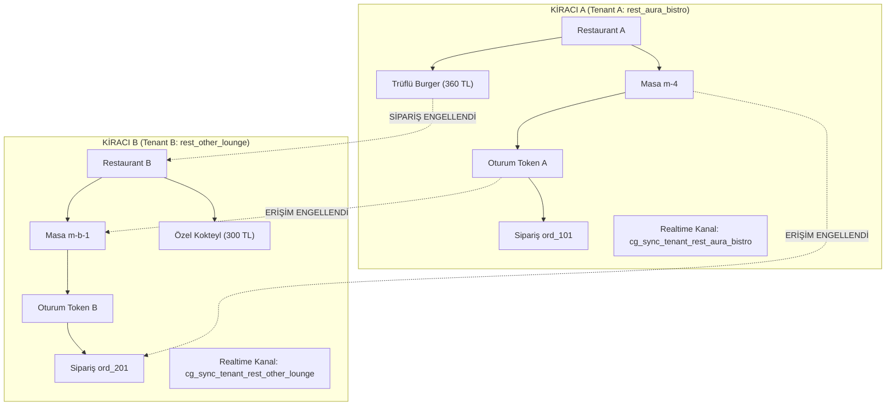

# CEP GARSON — TAM ÇOK KİRACILI İZOLASYON MİMARİSİ (TENANT ISOLATION)
**Faz:** FAZ 3 — Full Multi-Tenant Isolation & Anti-Escape Architecture  
**Tarih:** 2026-08-21  
**Durum:** TAMAMLANDI VE DOĞRULANDI (Verified 100%)  

---

## 1. ÇOK KİRACILI (MULTI-TENANT) SINIRLARI VE SAHİPLİK ZİNCİRİ

---

## 2. MERKEZİ SAHİPLİK DOĞRULAMA KONTROLLERİ ([`tenantGuard.ts`](file:///c:/Users/ali_h/Desktop/Kvk%20Dijital/src/lib/restaurant/tenantGuard.ts))

Her API çağrısında ve arka plan işleminde aşağıdaki sahiplik zinciri (`ownership chain`) doğrulanır:

1. **`resolveTenant(tenantId)`:** Kiracı kimliğini sisteme kayıtlı restoranlarla eşleştirir.
2. **`assertTableOwnership(tenantId, tableId)`:** Masanın belirtilen restorana ait olduğunu kesinleştirir (`TENANT_MISMATCH` koruması).
3. **`assertOrderOwnership(tenantId, order)`:** Siparişin başka bir restorana ait olmadığını doğrular.
4. **`assertMenuItemOwnership(tenantId, menuItemId)`:** Menü ürününün ilgili kiracının menüsünde yer aldığını denetler.
5. **`assertSessionOwnership(tenantId, tableId, token)`:** Oturum anahtarının hedef masa ve restorana ait olduğunu doğrular.
