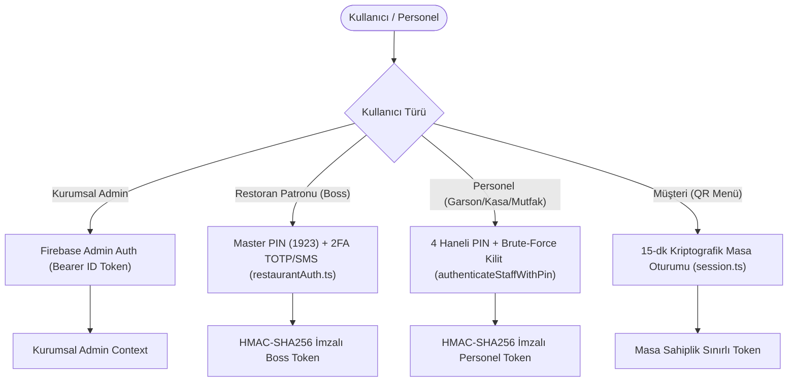

# CEP GARSON — KİMLİK DOĞRULAMA GÜVENLİĞİ (AUTHENTICATION SECURITY)
**Faz:** FAZ 4 — Authentication & Identity Hardening  
**Tarih:** 2026-08-21  
**Durum:** TAMAMLANDI VE DOĞRULANDI (Verified 100%)  

---

## 1. KİMLİK DOĞRULAMA YOLLARI VE MEKANİZMALARI

---

## 2. UYGULANAN GÜVENLİK KORUMALARI

1. **Zamanlama Saldırılarına Karşı Korumalı Doğrulama (`timingSafeCompare`):**
   - Tüm PIN ve gizli anahtar karşılaştırmaları `crypto.timingSafeEqual` ile sabit zamanda (constant-time) yürütülür. Yan kanal zamanlama analizleri engellenmiştir.
2. **Kaba Kuvvet (Brute-Force) ve Parola Püskürtme Koruması:**
   - 5 hatalı PIN denemesinde IP ve kullanıcı bazlı 15 dakikalık geçici hesap kilitlemesi (`ACCOUNT_LOCKED`) devreye girer.
3. **Devre Dışı / Silinmiş Hesap Koruması:**
   - `isActive: false` olan personeller geçerli PIN girseler dahi sisteme erişemez (`ACCOUNT_DISABLED`).
4. **Kullanıcı Numaralandırma (User Enumeration) Engelleme:**
   - Hatalı girişlerde generic `INVALID_CREDENTIALS` yanıtı dönülerek kullanıcı varlığı sızdırılmaz.
