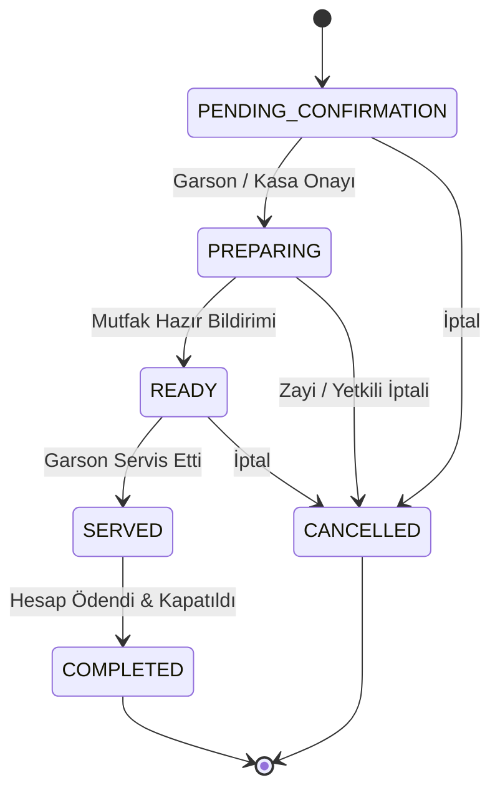

# CEP GARSON — İŞ MANTIĞI GÜVENLİĞİ VE DURUM MAKİNESİ (BUSINESS LOGIC)
**Faz:** FAZ 5 — Business Logic Security & State Machine Guard  
**Tarih:** 2026-08-21  

---

## 1. SİPARİŞ DURUM MAKİNESİ (ORDER STATE MACHINE)

---

## 2. ENGELLENEN GEÇERSİZ DURUM GEÇİŞLERİ

| Başlangıç Durumu | İstenen Durum | Sonuç | Açıklama |
| :--- | :--- | :--- | :--- |
| `COMPLETED` | `PENDING_CONFIRMATION` | 🔴 **BLOCKED** | Kapanmış sipariş tekrar işleme alınamaz. |
| `COMPLETED` | `PREPARING` | 🔴 **BLOCKED** | Kapanmış sipariş mutfağa geri gönderilemez. |
| `CANCELLED` | `READY` | 🔴 **BLOCKED** | İptal edilmiş sipariş mutfakta hazır yapılamaz. |
| `CANCELLED` | `COMPLETED` | 🔴 **BLOCKED** | İptal edilmiş sipariş adisyonu kapatılamaz. |
| `PAID_CASHIER` | `PENDING` | 🔴 **BLOCKED** | Ödenmiş hesap ödenmediye çekilemez. |
