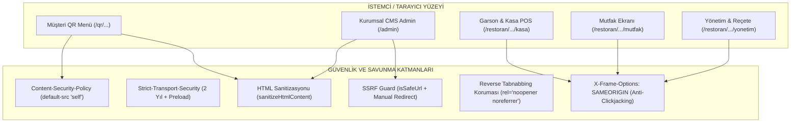

# CEP GARSON — WEB VE İSTEMCİ GÜVENLİK MİMARİSİ (WEB SECURITY)
**Faz:** FAZ 6 — Web Security, Client-Facing Attack Surface & Defense  
**Tarih:** 2026-08-21  
**Durum:** TAMAMLANDI VE DOĞRULANDI (Verified 100%)  

---

## 1. İSTEMCİ VE TARAYICI SALDIRI YÜZEYİ

---

## 2. TEMEL SAVUNMA MEKANİZMALARI

1. **Katı CSP (Content-Security-Policy):** `default-src 'self'`, `object-src 'none'`, `base-uri 'self'`, `form-action 'self'`, `frame-ancestors 'self'`.
2. **Kapsamlı XSS Koruması:** `dangerouslySetInnerHTML` yalnızca sanitize edilmiş blog içeriğinde kullanılır; tüm JSON-LD betikleri `<` kaçış karakteri (`\u003c`) ile korunur.
3. **SSRF Savunması:** Sunucu tarafından URL çağrısı yapılan `/api/seo-audit` rotasında döngüsel (loopback), yerel (private/RFC 1918), bulut metadata (`169.254.169.254`) ve dinamik DNS IP adresleri tamamen engellenmiştir.
4. **Ters Sekme Ele Geçirme (Anti-Reverse Tabnabbing):** Tüm harici bağlantılarda `rel="noopener noreferrer"` zorunludur.
