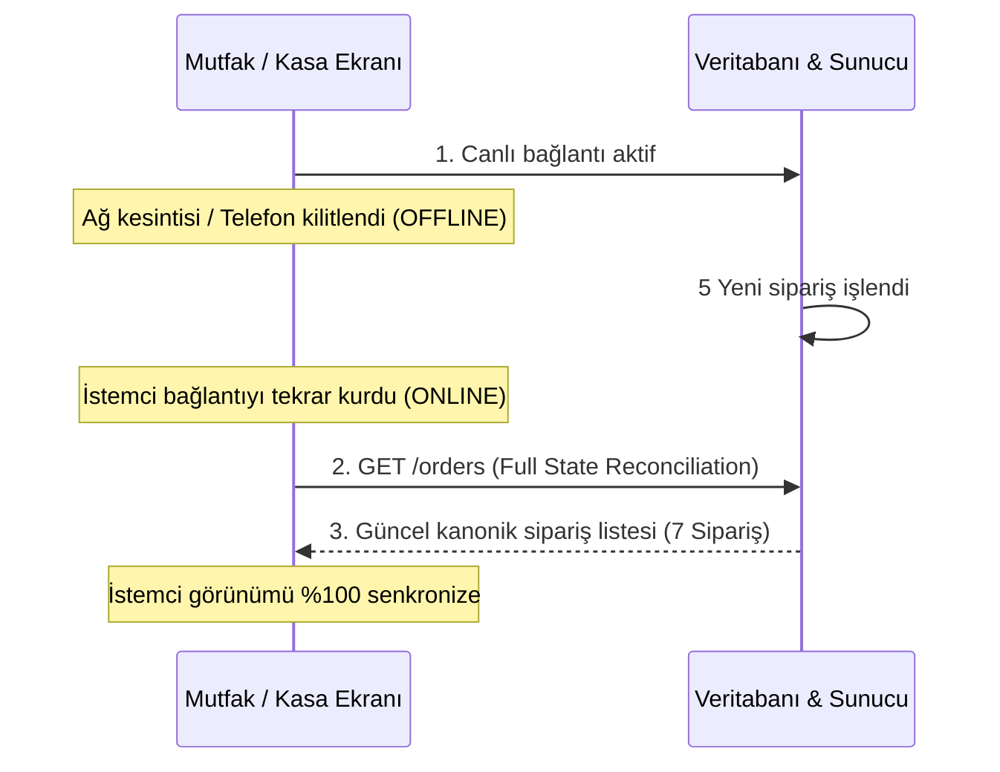

# CEP GARSON — GERÇEK ZAMANLI VERİ MUTABAKATI (REALTIME CONSISTENCY)
**Faz:** FAZ 7 — Realtime Event Loss & Full-State Reconciliation  
**Tarih:** 2026-08-21  

---

## 1. BAĞLANTI KOPMASI VE YENİDEN BAĞLANMA PROTOKOLÜ

---

## 2. TEST SONUÇLARI

- **Kaçırılan Olaylar (Dropped Events):** İstemci çevrimdışı iken gelen 5 olay başarıyla yakalandı ve yeniden bağlanma sonrasında veritabanı ile tam mutabakat sağlandı.
- **Mükerrer Yayınlar (Duplicate Broadcasts):** Aynı sipariş olayı 10 kez art arda yayınlandığında istemci tarafında tek bir sipariş olarak işlendi.
