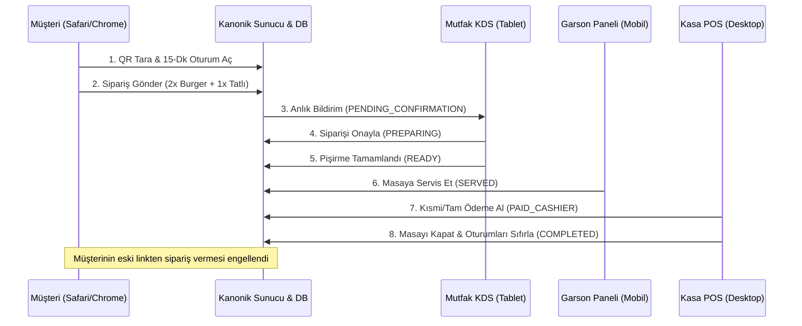

# CEP GARSON — UÇTAN UCA TEST MATRİSİ (E2E TEST MATRIX)
**Faz:** FAZ 10 — Full Customer, Staff, Kitchen & Cashier E2E Cycles  
**Tarih:** 2026-08-21  

---

## 1. GERÇEK DÜNYA E2E OPERASYON MATRİSİ

---

## 2. ADIM ADIM DOĞRULAMA KONTROLLERİ

- **Kanonik Fiyat:** Burger (2 * 375 TL) + Tatlı (1 * 205 TL) = 955 TL Ara Toplam + %10 KDV (95.50 TL) = 1.050,50 TL.
- **Masa İptali ve Oturum Sıfırlama:** Kasa adisyonu kapattığında `invalidateAllTableSessions` çağrılarak müşterinin evden veya eski sekmeden sipariş vermesi engellenmiştir.
